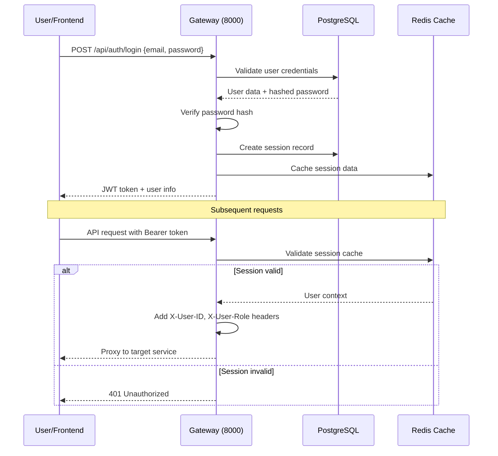
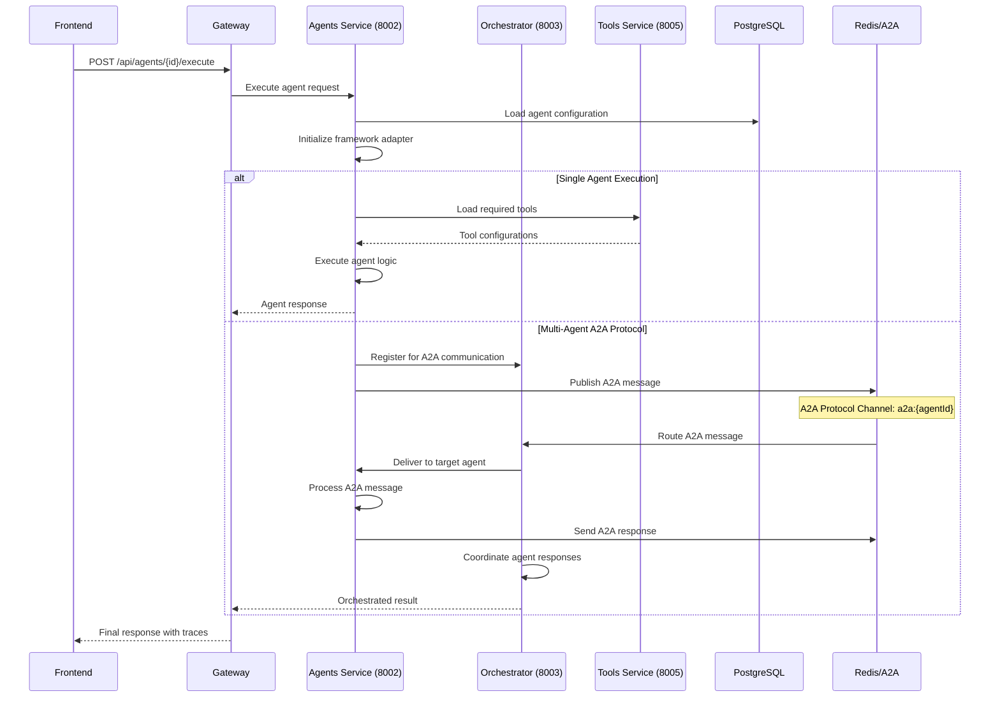
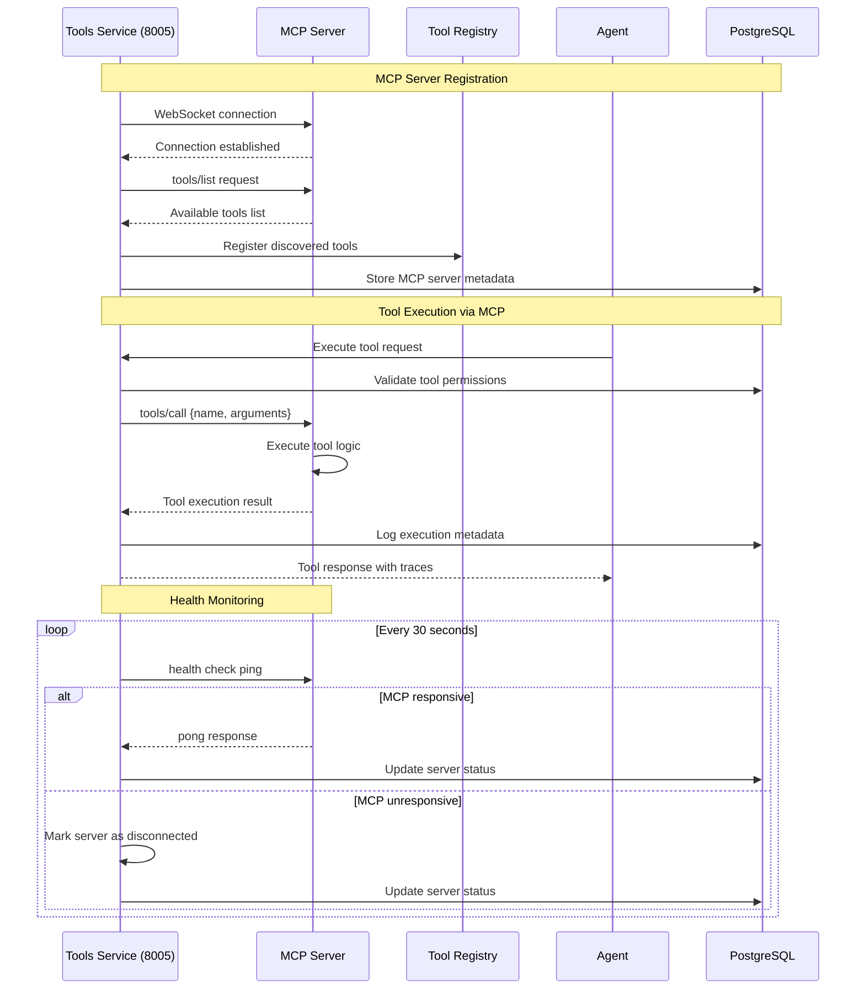
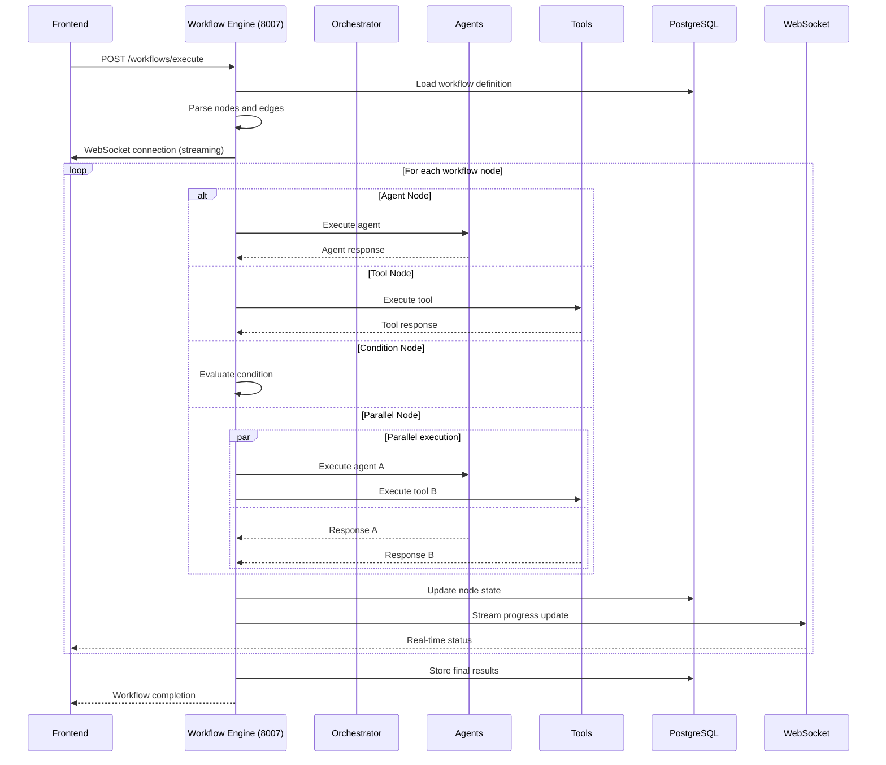
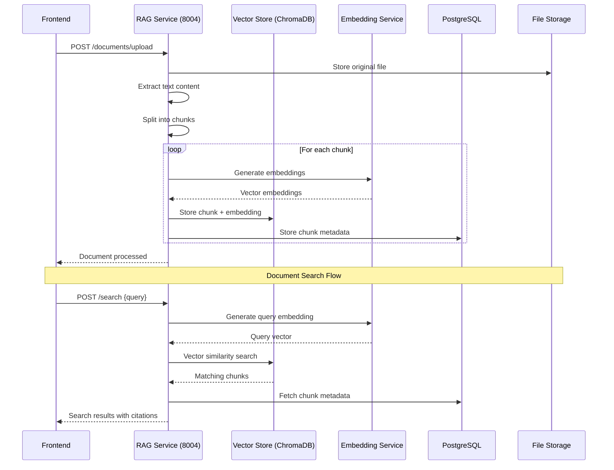
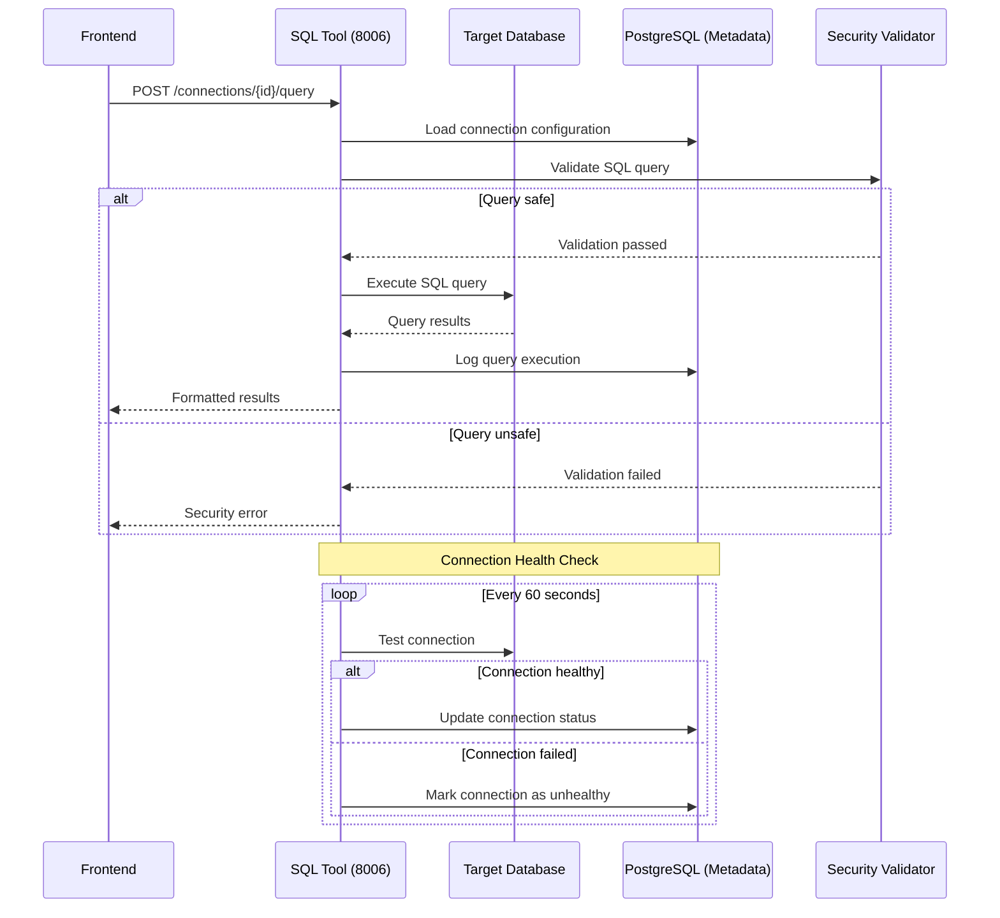
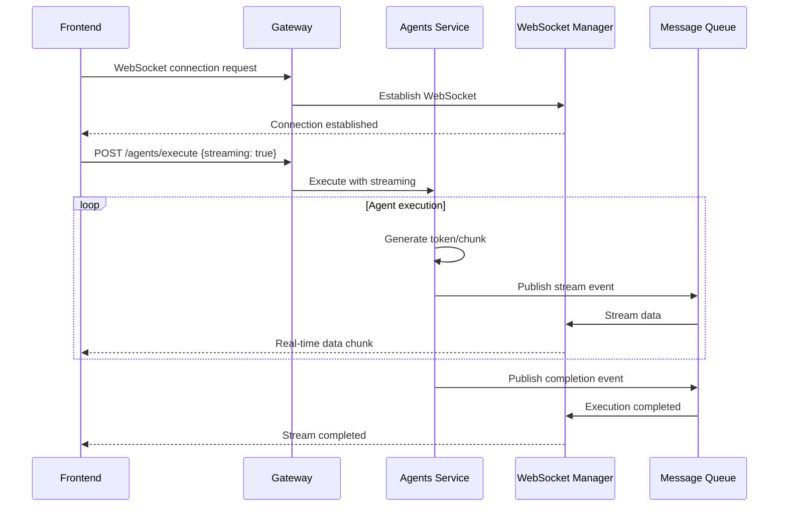
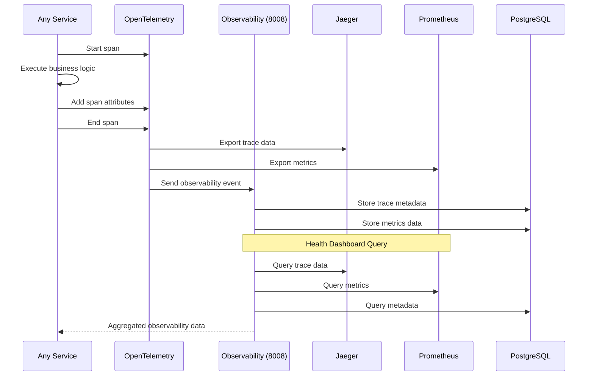
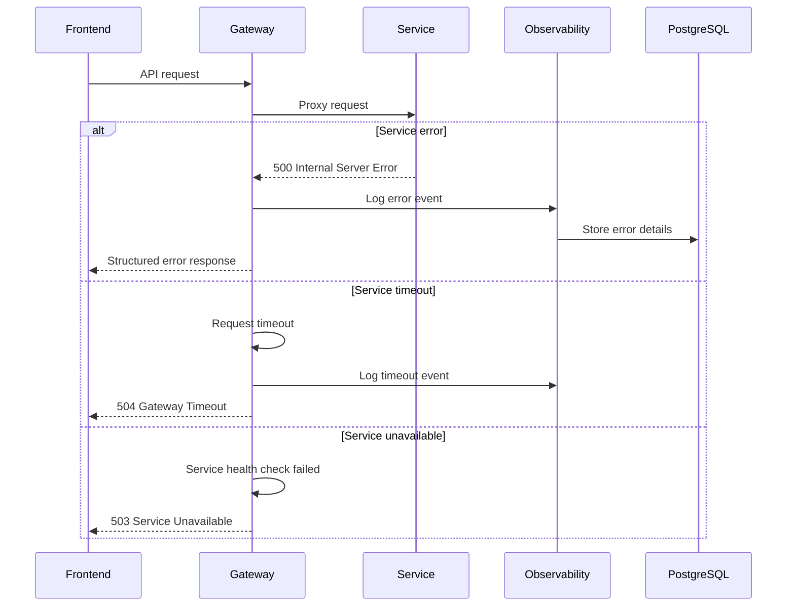
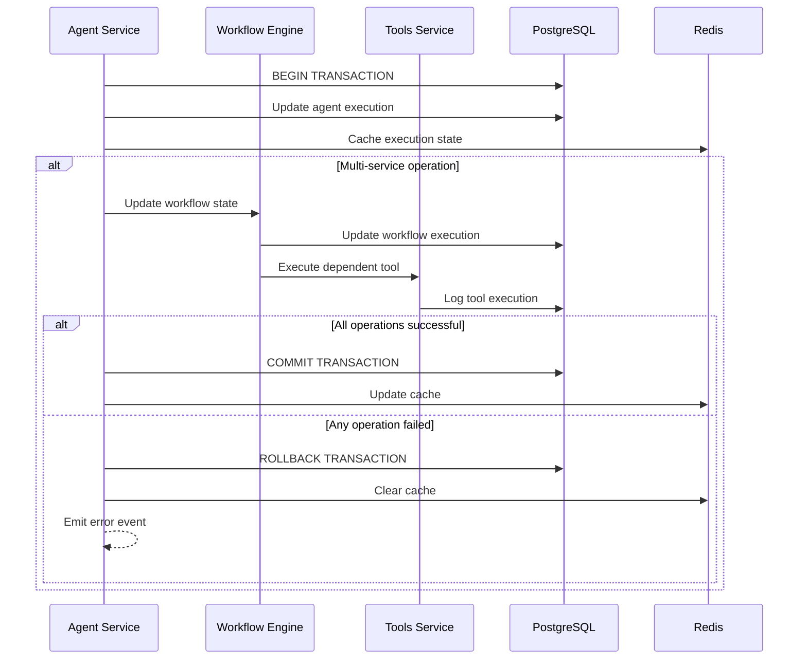

# Data Flow Sequences Documentation

> **Comprehensive data flow sequences for Agentic AI Acceleration with A2A Protocol and MCP Server integration**

## Overview

This document outlines the detailed data flow sequences within the Agentic AI Acceleration, including A2A (Agent-to-Agent) protocol communication, MCP (Model Context Protocol) server integration, and real-time streaming capabilities. These sequences define how data flows between microservices, agents, tools, and external systems.

## 1. Authentication & Gateway Flow

## 2. Agent Execution Flow with A2A Protocol

## 3. MCP Server Integration Flow

## 4. Workflow Engine Execution Flow

## 5. RAG Document Processing Flow

## 6. SQL Tool Execution Flow

## 7. Real-time Streaming Flow

## 8. Observability & Tracing Flow

## 9. Cross-Service Error Handling Flow

## 10. Data Consistency & Transaction Flow

## Flow Summary

### Key Data Flow Characteristics:

1. **Asynchronous Processing**: Most operations use async/await patterns
2. **Event-Driven Architecture**: Redis pub/sub for A2A communication
3. **Streaming Support**: Real-time data delivery via WebSockets
4. **Comprehensive Tracing**: OpenTelemetry integration across all services
5. **Resilient Design**: Timeout handling, retries, and graceful degradation
6. **Security-First**: Authentication, authorization, and input validation at every layer

### Performance Considerations:

- **Connection Pooling**: Database and Redis connections are pooled
- **Caching Strategy**: Redis for session data and frequently accessed metadata
- **Batch Processing**: Tool discoveries and embeddings processed in batches
- **Load Balancing**: Services designed for horizontal scaling
- **Circuit Breakers**: Prevent cascade failures between services