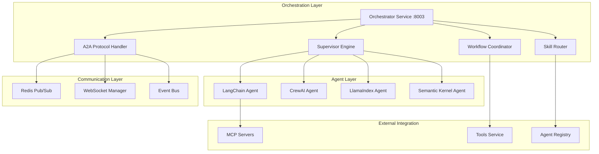

# Multi-Agent Orchestration Documentation

> **Advanced multi-agent orchestration with A2A Protocol, dynamic coordination, and real-time collaboration**

## Overview

The Multi-Agent Orchestration module is the intelligence core of the Agentic AI Acceleration, implementing sophisticated A2A (Agent-to-Agent) protocol communication, dynamic skill-based routing, and real-time coordination patterns. This system enables autonomous agents to collaborate, negotiate, and achieve complex goals through structured interactions.

## Architecture Overview



## Core Components

### 1. Orchestrator Service (`http://orchestrator:8003`)

#### 1.1 Service Configuration
```typescript
interface OrchestratorConfig {
  port: number;                    // Service port (8003)
  maxConcurrentWorkflows: number;  // Maximum parallel workflows
  a2aProtocol: {
    enabled: boolean;             // Enable A2A communication
    messageTimeout: number;       // Message timeout in ms
    retryAttempts: number;        // Retry attempts for failed messages
    broadcastChannels: string[];  // Broadcast channel names
  };
  coordination: {
    consensusThreshold: number;   // Agent consensus threshold (0.0-1.0)
    maxIterations: number;        // Maximum coordination cycles
    dynamicSkillMapping: boolean; // Enable dynamic skill discovery
  };
  healthCheck: {
    interval: number;             // Health check interval
    url: string;                  // Health endpoint URL
  };
}
```

#### 1.2 API Endpoints with Input/Output Signatures

```typescript
// POST /api/v1/orchestration/execute
interface OrchestrationExecuteRequest {
  workflow: {
    id?: string;                  // Optional workflow template ID
    name: string;                 // Workflow display name
    agents: Array<{
      id: string;                 // Agent unique identifier
      role: string;               // Agent role (analyzer, executor, reviewer)
      priority: number;           // Execution priority (1-10)
      config?: {
        temperature?: number;     // AI model temperature
        maxTokens?: number;       // Maximum response tokens
        tools?: string[];         // Available tool IDs
      };
    }>;
    coordination: {
      type: 'sequential' | 'parallel' | 'dynamic' | 'consensus';
      maxIterations?: number;     // Maximum coordination cycles
      consensusThreshold?: number; // Required consensus level
      timeoutMs?: number;         // Execution timeout
    };
  };
  input: {
    message: string;              // Primary input message
    context?: Record<string, any>; // Additional context data
    requirements?: string[];      // Specific requirements
    constraints?: string[];       // Execution constraints
  };
  options: {
    streaming?: boolean;          // Enable real-time streaming
    a2aProtocol?: boolean;        // Use A2A communication
    observability?: boolean;      // Enable detailed tracing
    returnIntermediateSteps?: boolean; // Return step-by-step results
  };
}

interface OrchestrationExecuteResponse {
  executionId: string;            // Unique execution identifier
  status: 'running' | 'completed' | 'failed' | 'cancelled' | 'paused';
  workflow: {
    id: string;                   // Workflow ID
    name: string;                 // Workflow name
    totalAgents: number;          // Number of participating agents
    coordinationType: string;     // Coordination strategy used
  };
  result?: {
    finalOutput: string;          // Consolidated final result
    confidence: number;           // Result confidence score (0.0-1.0)
    agentContributions: Array<{
      agentId: string;            // Contributing agent ID
      role: string;               // Agent role
      output: string;             // Agent-specific output
      confidence: number;         // Agent confidence score
      executionTime: number;      // Execution time in ms
      toolsUsed: string[];        // Tools utilized by agent
    }>;
    coordination: {
      iterationsUsed: number;     // Coordination cycles completed
      consensusReached: boolean;  // Whether consensus was achieved
      collaborationScore: number; // Collaboration effectiveness (0.0-1.0)
      conflictResolution: Array<{
        iteration: number;        // Iteration where conflict occurred
        conflictType: string;     // Type of conflict
        resolution: string;       // How it was resolved
        participatingAgents: string[]; // Agents involved
      }>;
    };
  };
  traces: {
    a2aMessages: Array<{
      id: string;                 // Message unique ID
      from: string;               // Sender agent ID
      to: string;                 // Receiver agent ID (or '*' for broadcast)
      type: 'request' | 'response' | 'broadcast' | 'negotiation';
      content: {
        intent: string;           // Message intent
        data: any;                // Message payload
        priority: number;         // Message priority
      };
      timestamp: string;          // ISO timestamp
      traceId: string;            // Execution trace ID
      acknowledged: boolean;      // Message acknowledgment status
    }>;
    executionSteps: Array<{
      stepId: string;             // Step identifier
      agentId: string;            // Executing agent
      action: string;             // Action performed
      input: any;                 // Step input
      output: any;                // Step output
      duration: number;           // Step duration in ms
      timestamp: string;          // Step timestamp
    }>;
  };
  metadata: {
    startTime: string;            // Execution start time (ISO)
    endTime?: string;             // Execution end time (ISO)
    totalDuration?: number;       // Total execution time in ms
    resourceUsage: {
      cpuTime: number;            // CPU time used
      memoryPeak: number;         // Peak memory usage
      apiCalls: number;           // Total API calls made
      totalTokens: number;        // Total tokens consumed
    };
  };
  traceId: string;                // OpenTelemetry trace ID
  healthUrls: string[];           // Health check URLs for involved services
}

// WebSocket Stream: /api/v1/orchestration/stream/{executionId}
interface OrchestrationStreamEvent {
  type: 'workflow_started' | 'agent_assigned' | 'agent_executing' | 'agent_completed' | 
        'a2a_message_sent' | 'a2a_message_received' | 'coordination_update' | 
        'consensus_reached' | 'workflow_completed' | 'workflow_failed';
  data: {
    executionId: string;          // Execution ID
    agentId?: string;             // Relevant agent ID
    message?: string;             // Status message
    output?: any;                 // Agent output (if applicable)
    a2aMessage?: {
      from: string;               // Sender agent
      to: string;                 // Receiver agent
      content: any;               // Message content
    };
    coordination?: {
      iteration: number;          // Current iteration
      consensus: number;          // Current consensus level
      participatingAgents: string[]; // Active agents
    };
    progress: {
      completedSteps: number;     // Steps completed
      totalSteps: number;         // Total steps
      percentage: number;         // Completion percentage
    };
    timestamp: string;            // Event timestamp
  };
  traceId: string;                // Trace ID
}
```

### 2. A2A Protocol Implementation

#### 2.1 Message Types and Structures
```typescript
interface A2AMessage {
  id: string;                     // Unique message ID
  version: string;                // Protocol version
  from: string;                   // Sender agent ID
  to: string | '*';               // Receiver agent ID or broadcast
  type: 'request' | 'response' | 'broadcast' | 'negotiation' | 'coordination';
  intent: string;                 // Message intent/purpose
  payload: {
    data: any;                    // Message data
    metadata: {
      priority: number;           // Message priority (1-10)
      timeout: number;            // Message timeout in ms
      retryCount: number;         // Current retry count
      correlationId?: string;     // For request-response correlation
      conversationId?: string;    // For multi-message conversations
    };
    context: {
      workflowId?: string;        // Associated workflow
      sessionId?: string;         // User session
      traceId: string;            // OpenTelemetry trace
    };
  };
  timestamp: string;              // Message timestamp
  signature?: string;             // Optional message signature for security
}

// A2A Negotiation Message for Consensus Building
interface A2ANegotiationMessage extends A2AMessage {
  type: 'negotiation';
  payload: {
    data: {
      proposal: {
        solution: string;         // Proposed solution
        confidence: number;       // Confidence in proposal
        reasoning: string;        // Reasoning behind proposal
        evidence: Array<{
          source: string;         // Evidence source
          type: 'data' | 'calculation' | 'external_tool';
          content: any;           // Evidence content
        }>;
      };
      vote?: {
        supports: boolean;        // Supports proposal
        alternatives?: string[];  // Alternative suggestions
        concerns?: string[];      // Concerns about proposal
      };
    };
    metadata: {
      negotiationRound: number;   // Current negotiation round
      participantCount: number;   // Total participants
      consensusTarget: number;    // Required consensus threshold
    };
  };
}
```

#### 2.2 A2A Protocol Handler
```typescript
class A2AProtocolHandler {
  private redis: RedisClient;
  private subscribers: Map<string, Set<A2AMessageHandler>>;
  private messageQueue: Map<string, A2AMessage[]>;
  private coordinationState: Map<string, CoordinationContext>;

  // Core A2A Methods with Input/Output Signatures
  async sendMessage(message: A2AMessage): Promise<A2AMessageResult> {
    // Input: A2AMessage with complete payload
    // Output: Delivery confirmation and trace information
    return {
      messageId: message.id,
      delivered: boolean,
      deliveryTime: number,
      traceId: string,
      error?: string
    };
  }

  async broadcastMessage(message: Omit<A2AMessage, 'to'>): Promise<A2ABroadcastResult> {
    // Input: Broadcast message without specific recipient
    // Output: Delivery status for all recipients
    return {
      messageId: string,
      totalRecipients: number,
      successfulDeliveries: number,
      failedDeliveries: Array<{agentId: string, error: string}>,
      traceId: string
    };
  }

  async negotiateConsensus(
    participants: string[], 
    proposal: ConsensusProposal,
    options: NegotiationOptions
  ): Promise<ConsensusResult> {
    // Input: Agent list, initial proposal, negotiation parameters
    // Output: Consensus result with voting details
    return {
      consensusReached: boolean,
      finalSolution: string,
      consensusLevel: number,
      votingRounds: number,
      participantVotes: Map<string, VoteRecord>,
      negotiationHistory: A2ANegotiationMessage[],
      traceId: string
    };
  }
}
```

### 3. Dynamic Coordination Patterns

#### 3.1 Sequential Coordination
```typescript
interface SequentialCoordination {
  pattern: 'sequential';
  agents: Array<{
    id: string;
    order: number;              // Execution order
    dependsOn?: string[];       // Dependencies on other agents
    passthrough: boolean;       // Pass output to next agent
  }>;
  errorHandling: {
    strategy: 'stop' | 'skip' | 'retry';
    maxRetries: number;
    fallbackAgent?: string;
  };
}
```

#### 3.2 Parallel Coordination
```typescript
interface ParallelCoordination {
  pattern: 'parallel';
  agents: Array<{
    id: string;
    partition?: string;         // Data partition for agent
    timeout: number;            // Individual timeout
  }>;
  aggregation: {
    strategy: 'merge' | 'vote' | 'best_confidence' | 'consensus';
    waitForAll: boolean;        // Wait for all agents vs. first N
    minimumResponses: number;   // Minimum responses required
  };
}
```

#### 3.3 Dynamic Coordination
```typescript
interface DynamicCoordination {
  pattern: 'dynamic';
  initialAgents: string[];      // Starting agent set
  expansion: {
    skillGaps: boolean;         // Auto-recruit for skill gaps
    workloadThreshold: number;  // Agent workload threshold
    maxAgents: number;          // Maximum total agents
  };
  adaptation: {
    performanceMonitoring: boolean; // Monitor agent performance
    reallocation: boolean;      // Reallocate underperforming agents
    dynamicSkillMapping: boolean; // Update skill mappings
  };
}
```

#### 3.4 Consensus Coordination
```typescript
interface ConsensusCoordination {
  pattern: 'consensus';
  agents: string[];             // Participating agents
  consensus: {
    algorithm: 'majority' | 'byzantine' | 'raft' | 'weighted';
    threshold: number;          // Required consensus percentage
    maxRounds: number;          // Maximum negotiation rounds
    timeoutPerRound: number;    // Timeout per negotiation round
  };
  conflictResolution: {
    strategy: 'expert_agent' | 'human_escalation' | 'weighted_vote';
    expertAgentId?: string;     // Expert agent for tie-breaking
    escalationWebhook?: string; // Human escalation endpoint
  };
}
```

### 4. Skill-Based Agent Routing

#### 4.1 Skill Registry
```typescript
interface AgentSkill {
  skillId: string;              // Unique skill identifier
  name: string;                 // Skill display name
  category: string;             // Skill category
  description: string;          // Skill description
  confidence: number;           // Agent confidence in skill (0.0-1.0)
  experience: {
    executions: number;         // Number of times used
    successRate: number;        // Success rate percentage
    averageExecutionTime: number; // Average execution time
    lastUsed: string;           // Last usage timestamp
  };
  prerequisites: string[];      // Required prerequisite skills
  complementarySkills: string[]; // Skills that work well together
  examples: Array<{
    input: string;              // Example input
    output: string;             // Example output
    scenario: string;           // Use case scenario
  }>;
}

interface AgentSkillMatrix {
  agentId: string;              // Agent identifier
  skills: AgentSkill[];         // Agent's skill set
  metadata: {
    totalSkills: number;        // Total number of skills
    averageConfidence: number;  // Average skill confidence
    specializations: string[];  // Primary specialization areas
    lastUpdated: string;        // Last skill update
  };
  performance: {
    overallRating: number;      // Overall performance rating
    collaborationScore: number; // Collaboration effectiveness
    adaptabilityScore: number;  // Ability to learn new skills
  };
}
```

#### 4.2 Skill Router Service
```typescript
class SkillRouterService {
  async routeToAgents(
    requiredSkills: string[],
    preferences: RoutingPreferences,
    context: RoutingContext
  ): Promise<AgentRoutingResult> {
    // Input: Required skills, routing preferences, execution context
    // Output: Optimal agent selection with routing rationale
    return {
      selectedAgents: Array<{
        agentId: string;
        assignedSkills: string[];
        confidence: number;
        estimatedExecutionTime: number;
        routingReason: string;
      }>,
      routingStrategy: string,
      skillCoverage: number,
      alternativeOptions: Array<{
        agents: string[];
        skillCoverage: number;
        estimatedCost: number;
      }>,
      traceId: string
    };
  }

  async updateSkillPerformance(
    agentId: string,
    skillId: string,
    performance: SkillPerformanceMetrics
  ): Promise<SkillUpdateResult> {
    // Input: Agent ID, skill ID, performance metrics
    // Output: Updated skill confidence and rankings
    return {
      updated: boolean,
      newConfidence: number,
      rankingChange: number,
      impactedRoutings: string[],
      traceId: string
    };
  }
}
```

### 5. Workflow Coordination Engine

#### 5.1 Coordination Context
```typescript
interface CoordinationContext {
  executionId: string;          // Unique execution ID
  workflowId: string;           // Workflow template ID
  coordinationType: CoordinationType;
  participants: Array<{
    agentId: string;
    role: string;
    status: 'active' | 'waiting' | 'completed' | 'failed';
    currentTask?: string;
  }>;
  state: {
    currentPhase: string;       // Current coordination phase
    iteration: number;          // Current iteration
    consensusLevel: number;     // Current consensus (0.0-1.0)
    intermediateResults: Map<string, any>; // Agent intermediate results
  };
  timeline: Array<{
    timestamp: string;
    event: string;
    agentId?: string;
    data?: any;
  }>;
  metrics: {
    startTime: string;
    phaseTransitions: number;
    messageCount: number;
    consensusAttempts: number;
  };
}
```

### 6. External Integration Points

#### 6.1 MCP Server Discovery
```typescript
interface MCPDiscoveryResult {
  serverId: string;             // MCP server identifier
  serverUrl: string;            // Server WebSocket URL
  capabilities: string[];       // Server capabilities
  discoveredTools: Array<{
    toolId: string;
    name: string;
    description: string;
    parameters: Record<string, any>;
    serverSpecific: boolean;
  }>;
  healthUrl: string;            // Server health endpoint
  status: 'connected' | 'disconnected' | 'error';
  lastDiscovery: string;        // Last discovery timestamp
}
```

#### 6.2 Tool Integration
```typescript
interface ToolExecutionRequest {
  toolId: string;               // Tool identifier
  parameters: Record<string, any>; // Tool parameters
  context: {
    executingAgent: string;     // Agent requesting tool
    workflowId?: string;        // Associated workflow
    coordination?: {
      phase: string;            // Coordination phase
      iteration: number;        // Current iteration
    };
  };
  timeout: number;              // Execution timeout
}

interface ToolExecutionResult {
  success: boolean;             // Execution success
  result: any;                  // Tool result data
  executionTime: number;        // Time taken in ms
  toolMetadata: {
    version: string;            // Tool version
    serverUrl?: string;         // MCP server (if applicable)
    capabilities: string[];     // Used capabilities
  };
  traceId: string;              // Execution trace
  error?: string;               // Error message if failed
}
```

## Advanced Features

### 1. Real-time Collaboration Monitoring
- Live visualization of agent interactions
- A2A message flow tracking
- Consensus building progress
- Performance metrics dashboard

### 2. Adaptive Coordination
- Dynamic skill discovery and mapping
- Performance-based agent selection
- Automatic workflow optimization
- Learning from coordination patterns

### 3. Fault Tolerance
- Agent failure detection and recovery
- Message retry mechanisms
- Graceful degradation strategies
- Circuit breaker patterns

### 4. Security & Governance
- A2A message authentication
- Agent permission management
- Audit trail for all interactions
- Compliance reporting

This orchestration system provides the foundation for sophisticated multi-agent collaboration, enabling autonomous agents to work together effectively while maintaining observability, security, and performance.