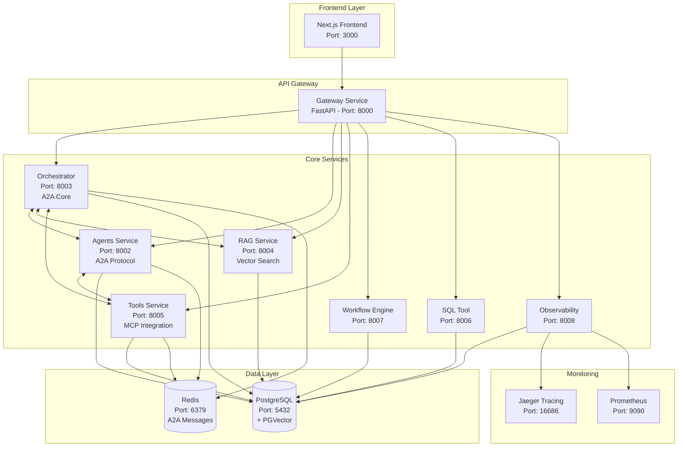

# Enterprise AI Multi-Agent Platform - System Architecture

## Overview

The Enterprise AI Multi-Agent Platform is a sophisticated microservices-based system that enables creation, orchestration, and management of AI agents with Agent-to-Agent (A2A) protocol support and Model Context Protocol (MCP) integration.

## High-Level Architecture



## Service Architecture

### 1. Frontend Layer (Next.js)
- **Technology**: Next.js 15.4.0 with TypeScript
- **UI Framework**: Tailwind CSS + shadcn/ui + Radix UI
- **State Management**: Zustand + React Query
- **Authentication**: NextAuth.js with multiple providers
- **Real-time**: WebSocket integration for A2A monitoring

### 2. API Gateway (Port: 8000)
- **Framework**: FastAPI with async/await
- **Responsibilities**:
  - Authentication & authorization (JWT)
  - Request routing to microservices
  - CORS handling
  - Rate limiting
  - API versioning
- **Security**: Role-based access control (RBAC)

### 3. Core Microservices

#### Orchestrator Service (Port: 8003)
- **Role**: A2A Protocol Core & Multi-Agent Coordination
- **Key Features**:
  - Agent-to-Agent message routing (JSON-RPC 2.0)
  - Workflow execution coordination
  - Agent capability discovery
  - Message queuing and persistence
- **A2A Protocol**: Central hub for agent communication

#### Agents Service (Port: 8002)
- **Role**: AI Agent Management & Execution
- **Supported Frameworks**:
  - LangChain
  - CrewAI
  - Semantic Kernel
  - AutoGen
- **Features**:
  - Agent lifecycle management
  - LLM provider integration (OpenAI, Google, Anthropic)
  - A2A capability registration
  - Agent state persistence

#### RAG Service (Port: 8004)
- **Role**: Retrieval-Augmented Generation
- **Vector Database**: PostgreSQL with PGVector extension
- **Features**:
  - Document ingestion and processing
  - Semantic search and retrieval
  - Vector embeddings management
  - Context-aware document chunks

#### Tools Service (Port: 8005)
- **Role**: Tool Integration Hub
- **Protocol**: Model Context Protocol (MCP) support
- **Features**:
  - External tool integration
  - MCP server registry
  - Tool capability discovery
  - Secure tool execution

#### Workflow Engine (Port: 8007)
- **Role**: Automation & Process Management
- **Features**:
  - Visual workflow designer
  - Step-by-step execution
  - Conditional logic and branching
  - Parallel task execution

#### SQL Tool Service (Port: 8006)
- **Role**: Database Query & Management
- **Supported Databases**: PostgreSQL, MySQL, SQLite, MSSQL
- **Features**:
  - Schema introspection
  - Query execution and optimization
  - Security and access control

#### Observability Service (Port: 8008)
- **Role**: Monitoring & Analytics
- **Features**:
  - Distributed tracing (OpenTelemetry)
  - Metrics collection (Prometheus)
  - A2A message flow monitoring
  - Performance analytics

### 4. Data Layer

#### PostgreSQL (Port: 5432)
- **Extensions**: PGVector for vector storage
- **Schema**: Comprehensive tables for agents, tools, workflows, users
- **Features**:
  - ACID compliance
  - Full-text search
  - Vector similarity search
  - Complex relationships

#### Redis (Port: 6379)
- **Usage**:
  - A2A message queuing
  - Session management
  - Caching layer
  - Pub/Sub for real-time updates

## A2A (Agent-to-Agent) Protocol

### Protocol Specification
- **Transport**: JSON-RPC 2.0 over HTTP/WebSocket
- **Message Format**:
```json
{
  "jsonrpc": "2.0",
  "method": "execute_task",
  "params": {
    "task": "analyze_document",
    "context": {},
    "agent_capabilities": ["text_analysis", "summarization"]
  },
  "id": "msg-123"
}
```

### Agent Registration
```python
@dataclass
class AgentCapability:
    name: str
    description: str
    input_schema: Dict
    output_schema: Dict

@dataclass  
class AgentCard:
    id: str
    name: str
    capabilities: List[AgentCapability]
    endpoints: Dict[str, str]
    health_url: str
```

### Message Flow
1. **Discovery**: Agents register capabilities with orchestrator
2. **Routing**: Orchestrator routes messages based on capabilities
3. **Execution**: Target agent processes request
4. **Response**: Results returned via A2A protocol
5. **Monitoring**: All interactions tracked for observability

## MCP (Model Context Protocol) Integration

### MCP Server Registry
- External tool discovery
- Capability validation
- Secure communication channels
- Version management

### Supported Tool Types
- Database connectors
- API integrations
- File system access
- External service calls

## Security Architecture

### Authentication & Authorization
- **JWT Tokens**: Secure API access
- **OAuth Providers**: GitHub, Google, Microsoft
- **RBAC**: Role-based permissions
- **API Keys**: Service-to-service auth

### Network Security
- **CORS**: Configured for frontend domains
- **Rate Limiting**: API endpoint protection
- **Input Validation**: Comprehensive request validation
- **Encryption**: TLS/SSL for all communications

## Scalability Considerations

### Horizontal Scaling
- Stateless microservices design
- Load balancer support
- Database connection pooling
- Redis clustering

### Performance Optimization
- Async/await throughout
- Connection pooling
- Caching strategies
- Background task processing

### Monitoring & Observability
- Health check endpoints
- Distributed tracing
- Metrics collection
- Real-time dashboards

## Technology Stack Summary

| Component | Technology | Version | Purpose |
|-----------|------------|---------|---------|
| Frontend | Next.js | 15.4.0 | React-based UI |
| Backend | FastAPI | Latest | Async Python API |
| Database | PostgreSQL | 16 | Primary data store |
| Vector DB | PGVector | Latest | Vector embeddings |
| Cache | Redis | 7 | Caching & messaging |
| Monitoring | Jaeger | 1.57 | Distributed tracing |
| Metrics | Prometheus | Latest | Metrics collection |
| Container | Docker | Latest | Containerization |
| Orchestration | Docker Compose | Latest | Multi-container apps |

## Deployment Architecture

### Development Environment
- Docker Compose for local development
- Hot reload for rapid iteration
- Shared development database
- Mock external services

### Production Environment
- Kubernetes for orchestration
- Separate databases per environment
- Load balancers and auto-scaling
- External monitoring integration

## Data Flow Patterns

### 1. User Interaction Flow
```
User → Frontend → Gateway → Service → Database → Response
```

### 2. A2A Communication Flow
```
Agent A → Orchestrator → Agent B → Processing → Response → Agent A
```

### 3. RAG Query Flow
```
Query → RAG Service → Vector Search → Document Retrieval → LLM → Response
```

### 4. Workflow Execution Flow
```
Trigger → Workflow Engine → Step Execution → Agent/Tool Calls → Completion
```

This architecture provides a robust, scalable foundation for enterprise AI applications with comprehensive agent management, real-time communication, and extensive observability capabilities.
